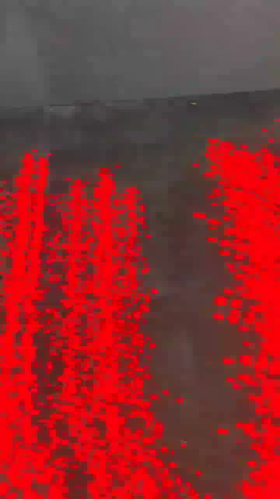
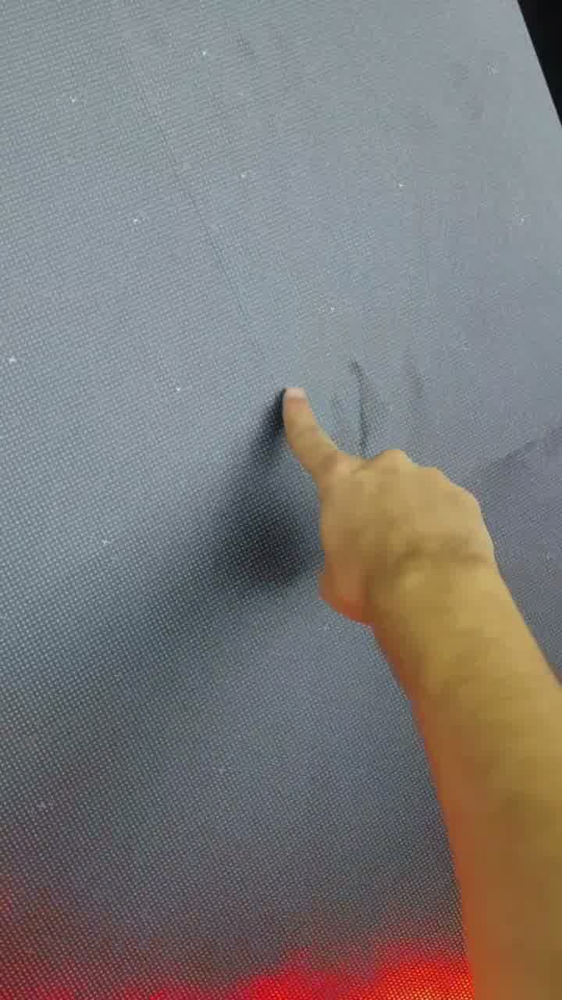
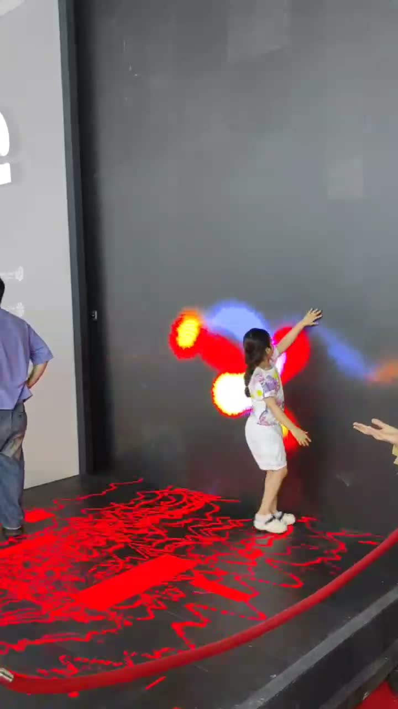

# LiDAR Touch Tracking

Real-time multi-touch detection and tracking from a 360° LiDAR sensor, built to drive an interactive LED wall game.

<video src="media/demo-touch-1.mp4" controls width="700" poster="media/hero-poster.jpg"></video>

*(demo clip — see [media/](media/) for more test footage)*

## Overview

This project turns a 360° LiDAR scanner into a large-scale, multi-touch interactive surface. A LiDAR unit mounted at the edge of an LED wall continuously scans the surface; raw distance points are filtered, clustered, and tracked over time to produce stable touch coordinates — each with a persistent ID — which drive an interactive game built in TouchDesigner.

The system was built for an interactive LED wall activation for **Dima**, the mobile app of **Bank Mellat** (Iran).


## System

```
LiDAR (360°)
    │
    ▼
ESP32 / MCU  — serial read
    │
    ▼
Host PC — point cloud processing
    │
    ▼
Filtering → Clustering → Touch Detection
    │
    ▼
Multi-Touch Tracking (persistent IDs)
    │
    ▼
OSC
    │
    ▼
TouchDesigner  →  LED Wall / Game
```


<sub>The system deployed at the Mellat Multiverse booth — LiDAR-driven floor projection reacting to a visitor in real time.</sub>

## Hardware

<table>
<tr>
<td></td>
<td></td>
</tr>
<tr>
<td align="center"><sub>LDROBOT D800 360° LiDAR</sub></td>
<td align="center"><sub>Sensor mount + ESP32 / driver electronics</sub></td>
</tr>
</table>

- **Sensor:** LDROBOT D800 360° LiDAR
- **Compute:** ESP32-based microcontroller(s) for sensor I/O, read over serial/USB by a host PC
- **Output:** OSC → TouchDesigner → LED wall

## Touch Detection & Tracking

The core problem: a LiDAR gives a noisy, unordered ring of distance points every frame — not touches. Getting from "points" to "stable multi-touch input" means solving a few distinct problems:

**Pipeline**

```
Raw Points → Filtering → Clustering → Touch Candidate → Persistent ID → Gesture
```

<table>
<tr>
<td></td>
<td></td>
<td></td>
</tr>
<tr>
<td align="center"><sub>1. Raw scan</sub></td>
<td align="center"><sub>2. Touch detected</sub></td>
<td align="center"><sub>3. Output on the wall</sub></td>
</tr>
</table>

1. **Filtering** — raw points are cleaned of sensor noise and the known static background (the wall itself) is subtracted, so only new objects (hands) remain.
2. **Clustering** — remaining points are grouped into candidate touch blobs.
3. **Persistent IDs** — each cluster is matched frame-to-frame against existing tracked touches by proximity, so the same hand keeps the same ID as it moves. New clusters get a new ID; touches that leave the surface are retired.
4. **Occlusion handling** — if a touch's points vanish for a split second (a dropped frame, a momentary sensor gap), its ID is kept alive for a short grace period and re-matched when it reappears, instead of being dropped and re-created. This keeps IDs clean and stable rather than flickering.
5. **Gesture output** — tracked per-ID motion over time is used to recognize gestures such as swipes.

This is what makes **multi-touch** possible on a sensor that has no concept of "touch" on its own — every object on the surface is tracked independently and concurrently, each with its own stable ID.



<sub>Each contact point on the surface is tracked independently, by ID, as shown in the pipeline above.</sub>

See [`demo/touch_tracking_concept.py`](demo/touch_tracking_concept.py) for a short, simplified illustration of the ID-matching and occlusion logic (not the production code — see [Note on code](#note-on-code) below).

<sub>Note: the three pipeline photos above are phone shots of the on-surface visual output, not a debug view of the point-cloud/ID data — included as real-world evidence that detection was tracking contact point accurately, not a software screenshot.</sub>

## Interactive LED Wall

Tracked touch points are sent over OSC into **TouchDesigner**, which runs the interactive game logic and drives the LED wall visuals in real time.


<sub>The installation at the **Mellat Multiverse** booth (Dima, Bank Mellat).</sub>

## Demo

<video src="media/demo-touch-2.mp4" controls width="500"></video> <video src="media/demo-touch-3.mp4" controls width="500"></video>

<video src="media/demo-touch-4.mp4" controls width="500"></video>

*(If videos don't render inline, see the files directly in [media/](media/).)*

## Repository Structure

```
LiDAR-Touch-Tracking/
├── README.md
├── LICENSE
├── media/              # hardware photos, test/demo videos
├── docs/               # real photos pulled from the test footage (see media/)
└── demo/
    └── touch_tracking_concept.py   # simplified, illustrative tracking logic
```

## Note on Code

This repository is a portfolio writeup of the project rather than the full production codebase. The script in [`demo/`](demo/) demonstrates the core tracking concept only.

## Credits

This project was developed by **[Your Name]** in collaboration with:

| Role | Name |
|---|---|
| Development | Wenodes |
| LiDAR processing & tracking support | [Arman-H-R](https://github.com/Arman-H-R) |
| LED wall visuals | Toomaj |
| Design | Parsa Dirbas |

Built for an interactive LED wall activation for **Dima** (Bank Mellat, Iran).

## License

[MIT](LICENSE)
