<p align="center">
  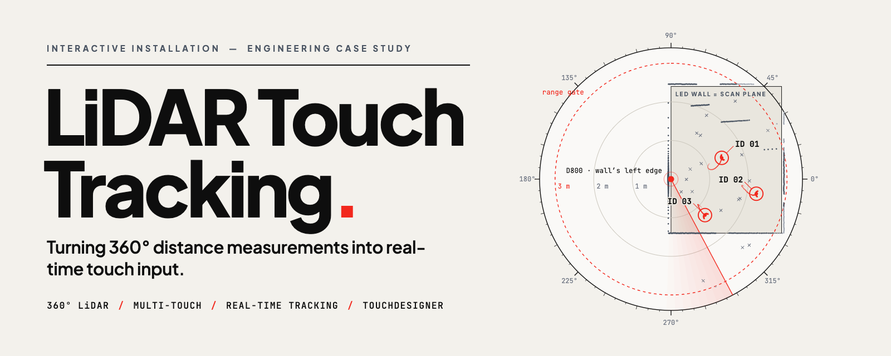
</p>

# LiDAR Touch Tracking

Real-time multi-touch detection and tracking from a single 360° LiDAR sensor, built to drive an interactive LED wall game.

One sensor on the edge of the wall reads the whole surface about 20 times a second. Its raw distance points are filtered, clustered and tracked into stable touches — each with a persistent ID — and sent over OSC to a game built in TouchDesigner.

<p>
  
  
  
  
  
</p>

## Watch

<p align="center">
  <a href="media/films/lidar-touch-tracking-technical.mp4">
    
  </a>
</p>
<p align="center">
  <sub><b>How it works, in 30 seconds.</b> Silent preview — <a href="media/films/lidar-touch-tracking-technical.mp4">open the film with sound</a>.</sub>
</p>

<table>
<tr>
<td width="50%" align="center">
  <a href="media/films/wenodes-case-study.mp4">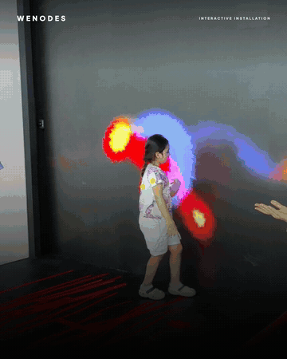</a>
</td>
<td width="50%" align="center">
  <a href="media/films/wenodes-teaser.mp4">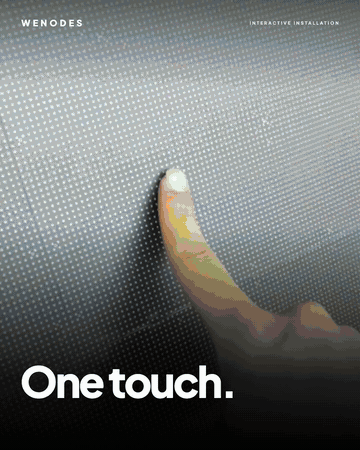</a>
</td>
</tr>
<tr>
<td align="center"><sub><b>The installation</b> — Sense, Track, Play (22 s)<br><a href="media/films/wenodes-case-study.mp4">open with sound</a></sub></td>
<td align="center"><sub><b>Teaser</b> — one touch, the wall answers (16 s)<br><a href="media/films/wenodes-teaser.mp4">open with sound</a></sub></td>
</tr>
</table>

## At a Glance

- **One sensor** — an LDROBOT D800 360° LiDAR on the wall's left edge, scanning a plane just in front of the LED surface.
- **About 20 scans a second**, roughly 600–860 distance points per scan (figures from the live tracker).
- **True multi-touch** — every touch is tracked independently, with an ID that survives movement and brief dropouts.
- **OSC out** — touches go to TouchDesigner, which runs the game and drives the wall in real time.
- **Deployed** — an interactive LED wall activation for **Dima**, the mobile app of **Bank Mellat** (Iran), at the Mellat Multiverse booth.

<table>
<tr>
<td>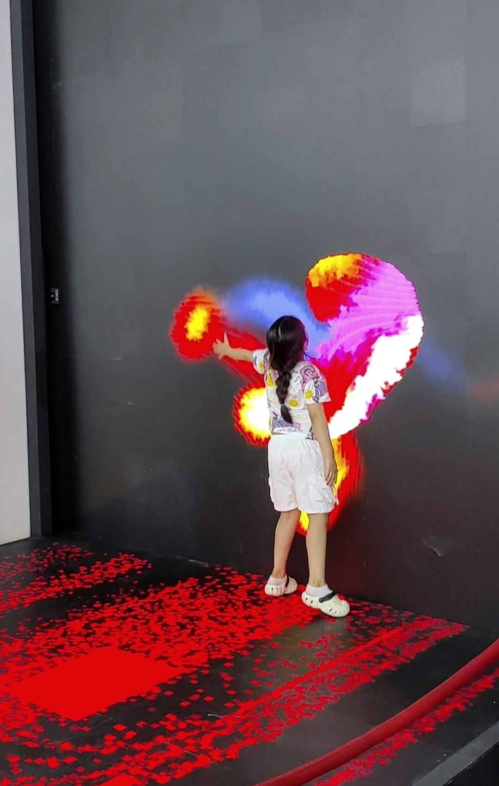</td>
<td>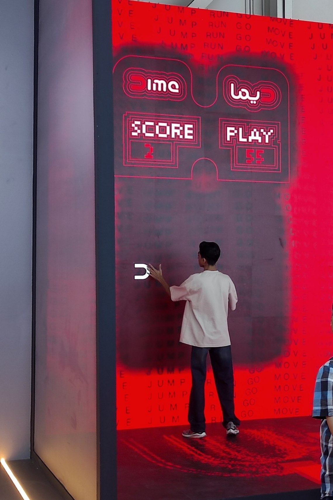</td>
</tr>
<tr>
<td align="center"><sub>The wall answering a touch</sub></td>
<td align="center"><sub>The Dima game — SCORE and PLAY, touch-controlled</sub></td>
</tr>
</table>


## Where the Sensor Sits

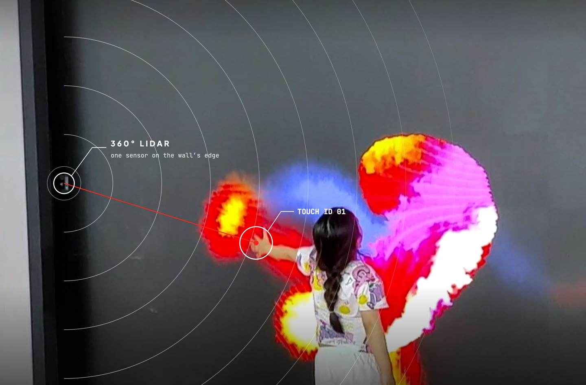

<sub>The real installation, with the sensor ringed. The arcs, the ray and the labels are drawn on; the photo is not.</sub>

The D800 is mounted on the left edge of the wall, at about chest height. Its scan plane lies just in front of the LED surface, so anything that reaches the wall — a hand, a fingertip — breaks the plane and shows up as a small cluster of points at that position.

Everything else the plane cuts through is static: the stage floor, the frame, the seams where it grazes the wall itself. That is learned once and subtracted, which is what leaves only touches.

## System

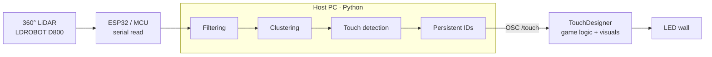
```mermaid
flowchart LR
    L["360° LiDAR<br/>LDROBOT D800"] --> E["ESP32 / MCU<br/>serial read"]
    E --> F
    subgraph PC["Host PC · Python"]
        direction LR
        F["Filtering"] --> C["Clustering"] --> T["Touch detection"] --> I["Persistent IDs"]
    end
    I -- "OSC /touch" --> TD["TouchDesigner<br/>game logic + visuals"]
    TD --> W["LED wall"]
```

<table>
<tr>
<td>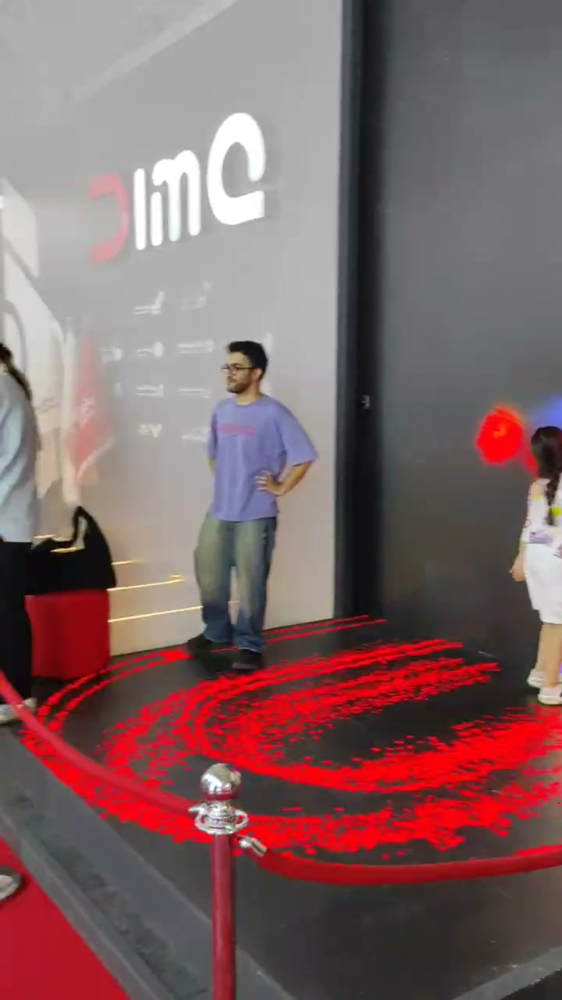</td>
<td>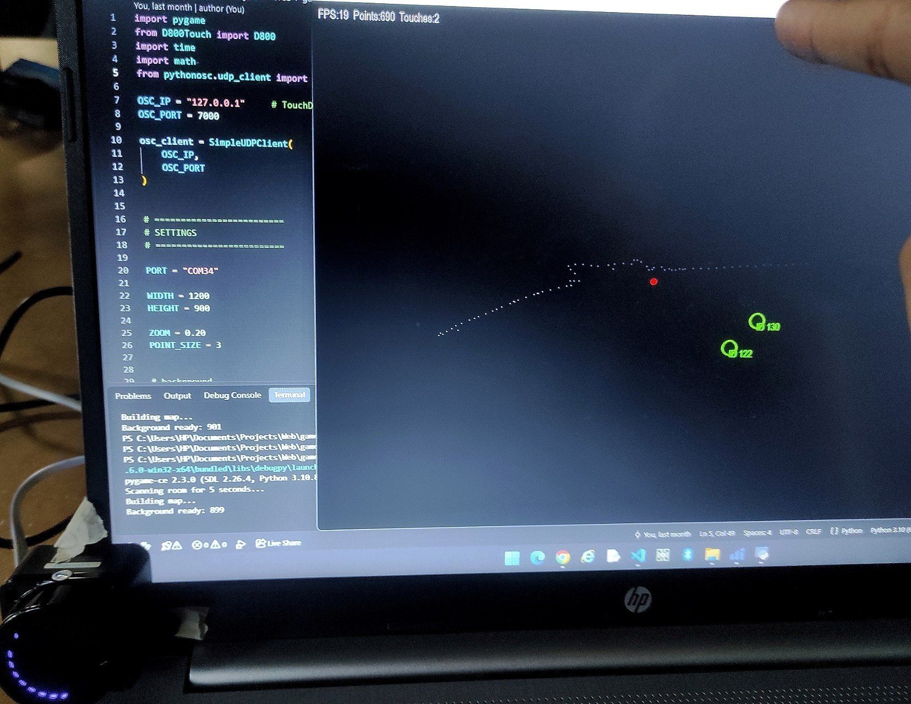</td>
</tr>
<tr>
<td align="center"><sub>Deployed at the Mellat Multiverse booth</sub></td>
<td align="center"><sub>Live-testing the tracking script, code next to output</sub></td>
</tr>
</table>

## Touch Detection & Tracking

The core problem: a LiDAR gives a noisy, unordered ring of distance points every frame — not touches. Getting from "points" to "stable multi-touch input" means solving a few distinct problems.

<table>
<tr>
<td>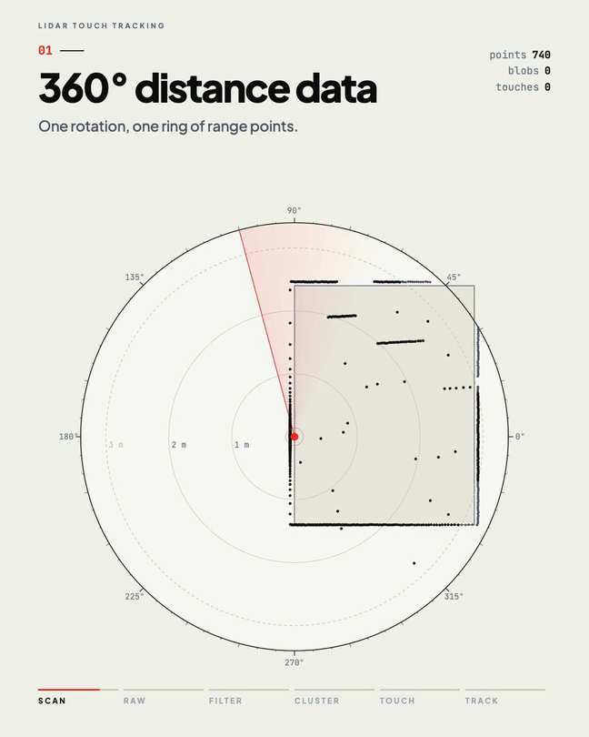</td>
<td>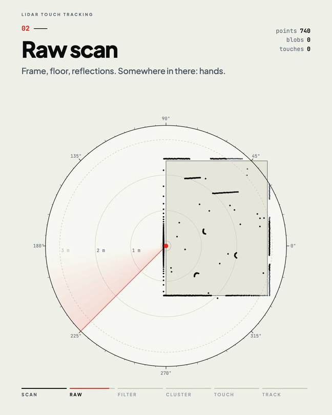</td>
<td>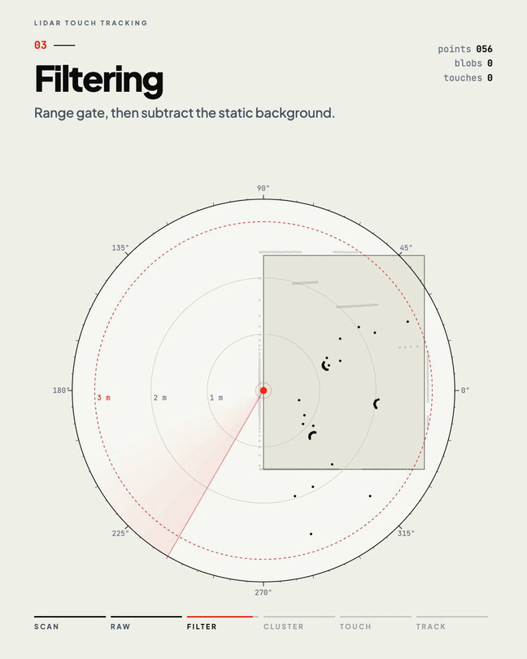</td>
</tr>
<tr>
<td>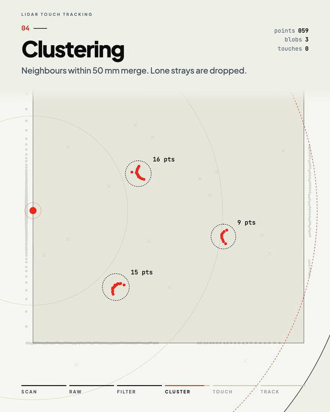</td>
<td>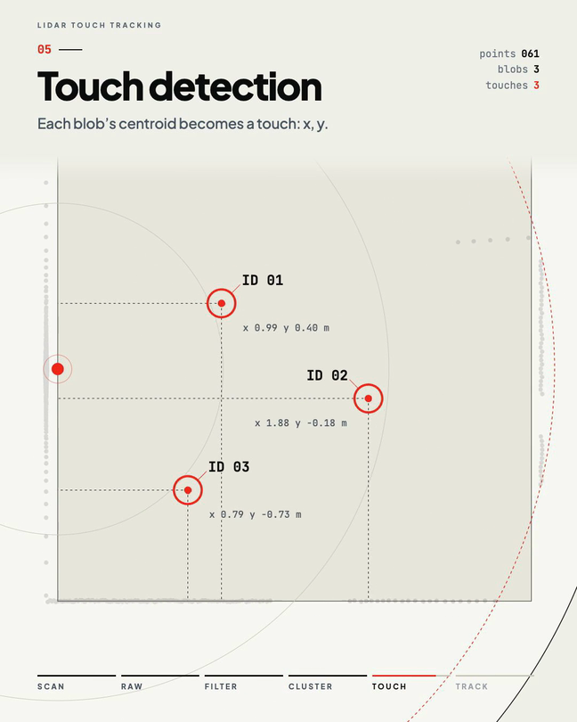</td>
<td>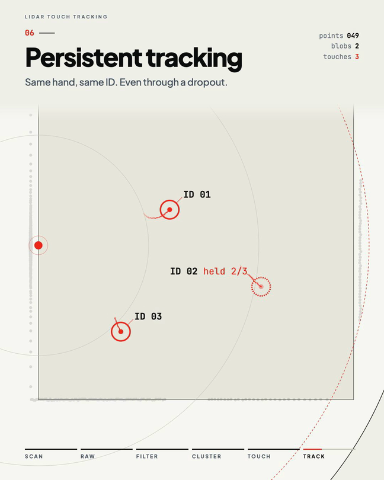</td>
</tr>
</table>

<sub>Frames from the film above. The wall in them is simulated; the filtering, clustering and ID matching that draw it are a port of the project's real tracking logic. Real captures of the tracker are further down.</sub>

1. **Scan** — every rotation returns one ring of range points: the frame, the floor, reflections, and somewhere in there, hands.
2. **Filtering** — points beyond a 3 m range gate are ignored. A background model, captured in a short calibration pass on the empty wall, is then subtracted, so only new objects (hands) remain.
3. **Clustering** — neighbouring points (within 50 mm of each other) merge into candidate touch blobs. A blob needs at least 4 points, which drops lone stray returns.
4. **Touch detection** — each blob's centroid becomes a touch coordinate.
5. **Persistent IDs** — each blob is matched frame-to-frame against existing tracked touches by proximity, so the same hand keeps the same ID as it moves. New blobs get a new ID; touches that leave the surface are retired.
6. **Occlusion handling** — if a touch's points vanish for a split second (a dropped frame, a momentary sensor gap, another hand in the way), its ID is kept alive for a short grace period — 3 frames — and re-matched when it reappears, instead of being dropped and re-created. This keeps IDs clean and stable rather than flickering.
7. **Gesture output** — tracked per-ID motion over time is used to recognize gestures such as swipes.

This is what makes **multi-touch** possible on a sensor that has no concept of "touch" on its own — every object on the surface is tracked independently and concurrently, each with its own stable ID.

### OSC output

Every tracked touch is sent to TouchDesigner as one message per frame:

```
/touch  x  y  id  state
```

| Field   | Meaning                                         |
| ------- | ----------------------------------------------- |
| `x`, `y` | Touch position on the wall, relative to the sensor |
| `id`    | The touch's persistent ID                       |
| `state` | `1` touch down · `0` moving · `-1` released    |

### The real tracker

<table>
<tr>
<td>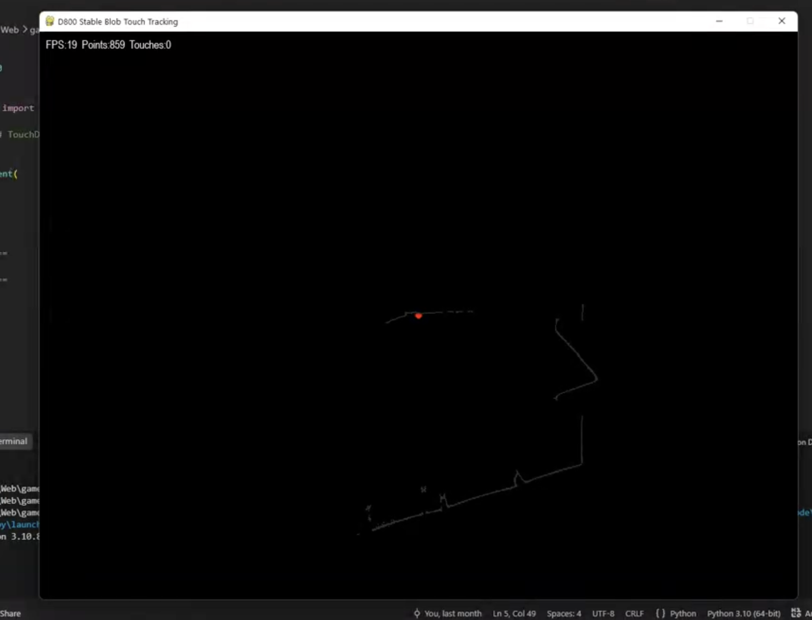</td>
<td>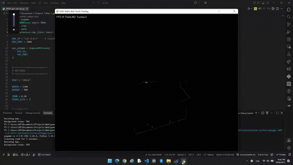</td>
<td>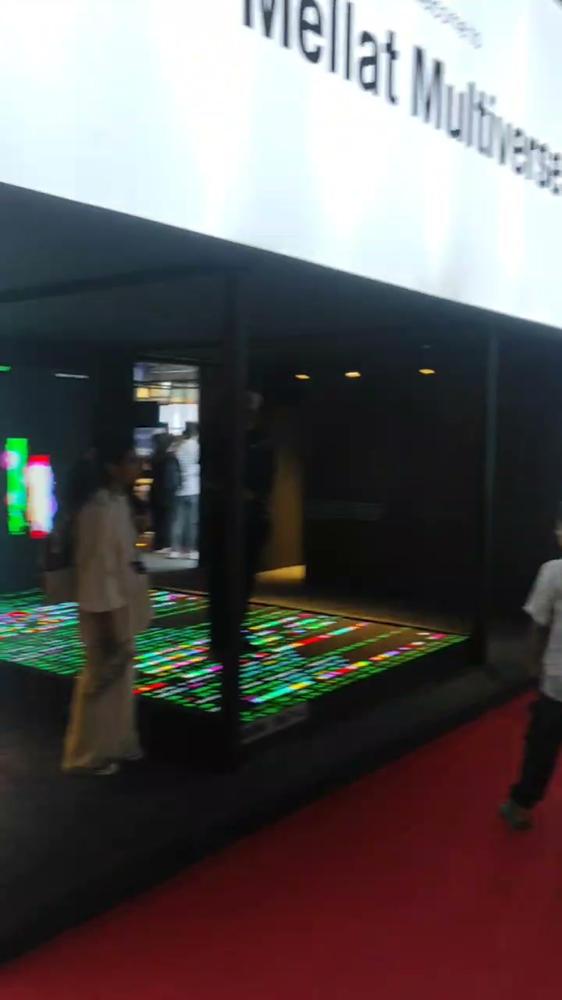</td>
</tr>
<tr>
<td align="center"><sub>1. Raw scan</sub></td>
<td align="center"><sub>2. Touch detected (live)</sub></td>
<td align="center"><sub>3. Output on the wall</sub></td>
</tr>
</table>

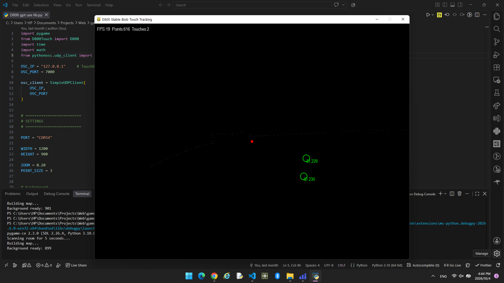

<sub>The actual tracking script running live — each tracked touch gets its own ID (here, <code>228</code> and <code>230</code>), alongside live FPS/point/touch counters.</sub>

<sub>Note: steps 1 and 2 above are real captures of the tracking script itself; step 3 is a phone photo of the resulting on-surface output.</sub>

See [`demo/touch_tracking_concept.py`](demo/touch_tracking_concept.py) for a short, simplified illustration of the ID-matching and occlusion logic (not the production code — see [Note on code](#note-on-code) below).

## Interactive LED Wall

Tracked touch points are sent over OSC into **TouchDesigner**, which runs the interactive game logic and drives the LED wall visuals in real time.

<table>
<tr>
<td>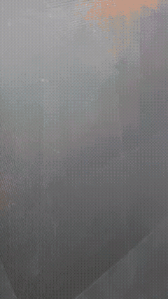</td>
<td></td>
</tr>
<tr>
<td align="center"><sub>Touch response on the surface</sub></td>
<td align="center"><sub>The installation at the <b>Mellat Multiverse</b> booth (Dima, Bank Mellat)</sub></td>
</tr>
</table>

## Hardware

<table>
<tr>
<td>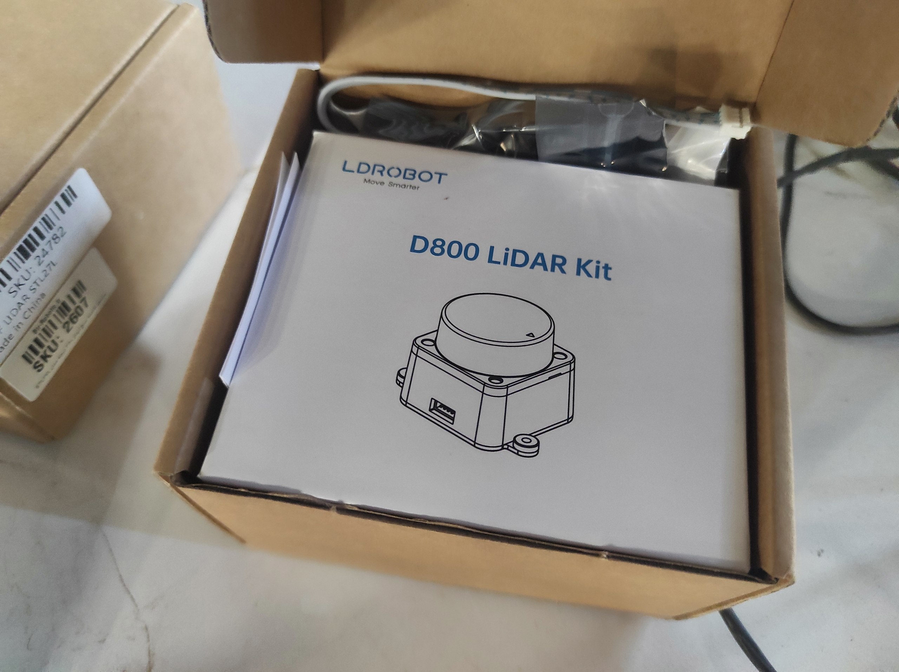</td>
<td>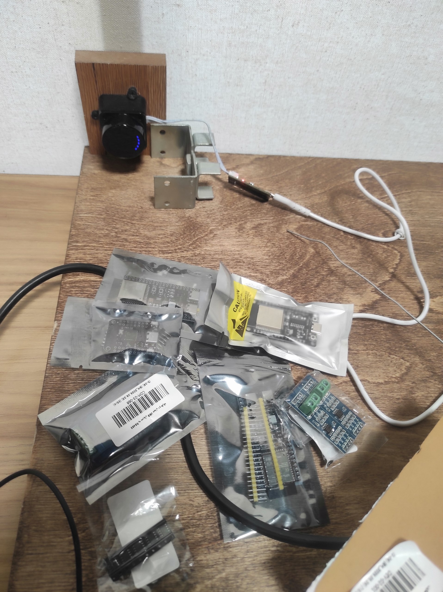</td>
</tr>
<tr>
<td align="center"><sub>LDROBOT D800 360° LiDAR</sub></td>
<td align="center"><sub>Sensor mount + ESP32 / driver electronics</sub></td>
</tr>
</table>

- **Sensor:** LDROBOT D800 360° LiDAR
- **Compute:** ESP32-based microcontroller(s) for sensor I/O, read over serial/USB by a host PC
- **Output:** OSC → TouchDesigner → LED wall

## Posters

<table>
<tr>
<td align="center"><a href="media/posters/poster-technical.png">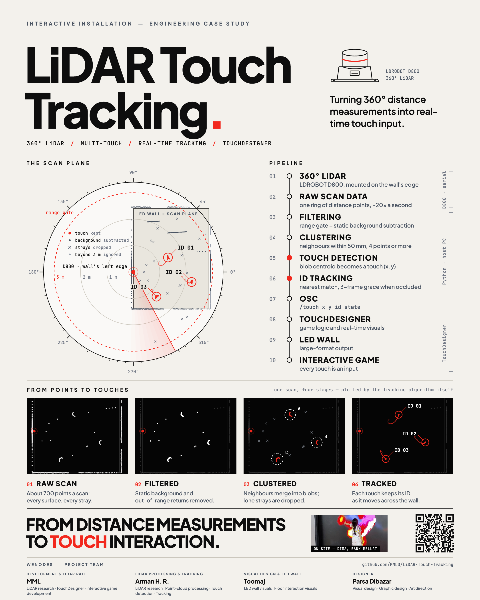</a></td>
<td align="center"><a href="media/posters/poster-wenodes-case-study.jpg">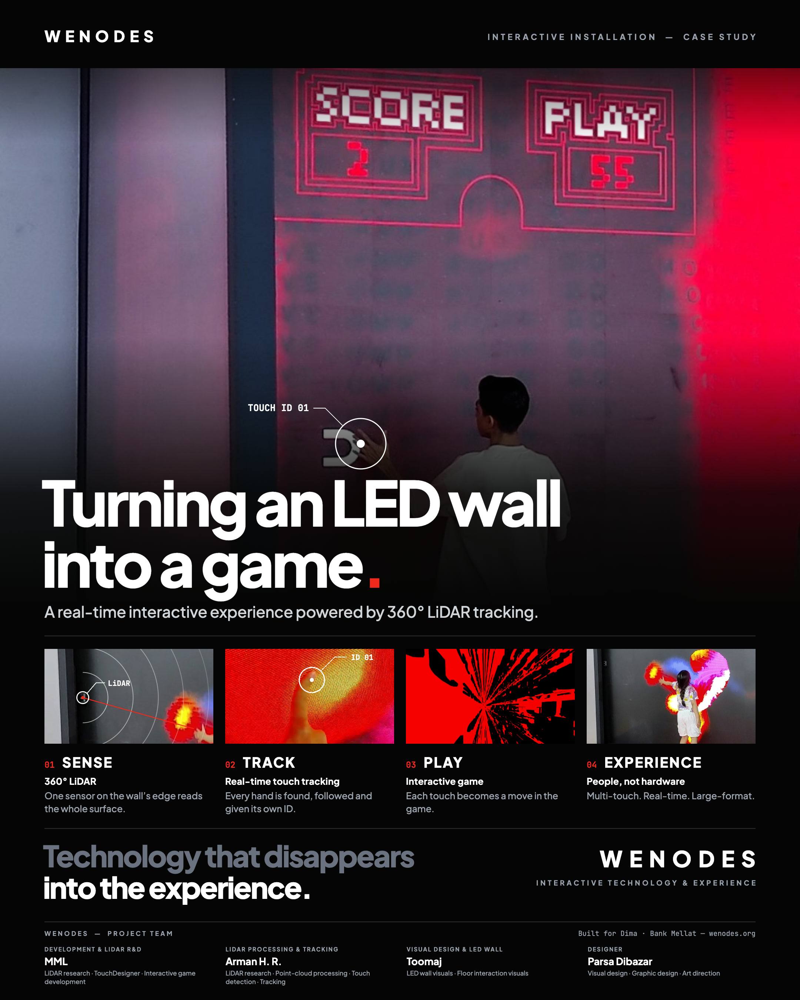</a></td>
<td align="center"><a href="media/posters/poster-wenodes-teaser.jpg">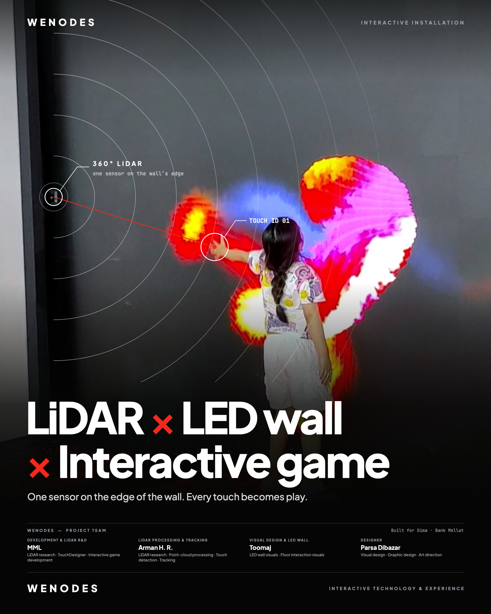</a></td>
</tr>
<tr>
<td align="center"><sub>The system on one sheet</sub></td>
<td align="center"><sub>Turning an LED wall into a game</sub></td>
<td align="center"><sub>LiDAR × LED wall × Interactive game</sub></td>
</tr>
</table>

## Repository Structure

```
LiDAR-Touch-Tracking/
├── README.md
├── LICENSE
├── demo/
│   ├── touch_tracking_concept.py   # simplified, illustrative tracking logic
│   └── D800Touch.py                # LDROBOT D800 serial reader (packet framing, CRC, points)
├── docs/                           # real photos pulled from the test footage
└── media/
    ├── films/                      # the three edited films, with sound
    ├── posters/                    # the three posters, full resolution
    ├── readme/                     # banner, previews and figures used on this page
    └── …                           # hardware photos, raw test clips, tracker captures
```

## Note on Code

This repository is a portfolio writeup of the project rather than the full production codebase. The scripts in [`demo/`](demo/) demonstrate the core tracking concept and the sensor reader only.

The diagrams in the films and posters are plotted from a simulated scan; all installation photos and footage are real. The films' music and sound design were synthesised for this project, with no third-party audio.

## Credits

| **Role**                    | **Name**                                                |
| --------------------------- | ------------------------------------------------------- |
| Development & LiDAR R&D     | [MML](https://github.com/MML0/)                         |
| LiDAR Processing & Tracking | [Arman H. R.](https://github.com/Arman-H-R)             |
| LED Wall Visuals            | [Toomaj](https://www.instagram.com/2maj.k)              |
| Design                      | [Parsa Dibazar](https://www.instagram.com/parsadibazar) |

**WENODES** — Interactive Technology & Experience

Built for an interactive LED wall activation for **Dima (Bank Mellat, Iran)**.

*This repo documents the LiDAR touch system specifically — the credits above are for the full game/installation team.*

## License

[MIT](LICENSE)
